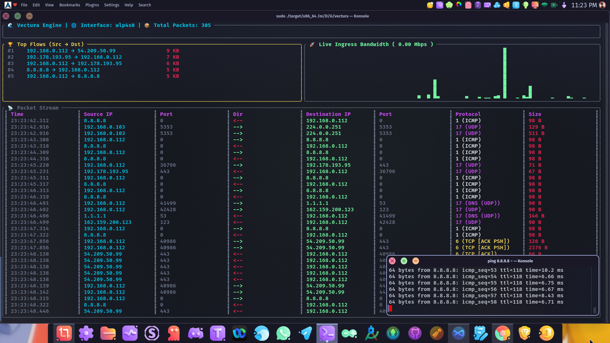

# 🚀 VECTURA: Next-Generation Network Observability

## Live Dashboard



**A Type & Memory Safe eBPF Network Analyzer built purely in Rust. 🦀**

Vectura (from the Latin word for "transport" or "carriage") is a modern, high-performance network observability platform. By leveraging the [Aya eBPF framework](https://aya-rs.dev/), Vectura injects memory-safe Rust code directly into the Linux kernel to analyze network packets at wire speed. It bridges that raw data to a rich, asynchronous terminal UI (TUI) and a headless API in user-space.

---

## 💡 The Inspiration

For decades, network analysis forced engineers to make a difficult choice:

1. **Use user-space tools** (like `tcpdump` or Wireshark via libpcap), which incur massive CPU overhead due to constant context-switching and packet copying between kernel and user space.
2. **Write custom Kernel Modules in C**, which are incredibly fast but highly dangerous—a single memory leak or null pointer can cause a catastrophic kernel panic and take down the entire server.

Enter **eBPF (Extended Berkeley Packet Filter)**. eBPF revolutionized Linux by allowing sandboxed programs to run inside the kernel safely. However, the standard toolchains (BCC, libbpf) still required writing the kernel code in C, relying on massive LLVM/Clang toolchains at runtime.

Vectura was inspired by a simple question: *What if we could build an enterprise-grade network monitor where EVERY layer is memory-safe?*
Powered by the Aya framework, Vectura proves that Rust can dominate both user-space and kernel-space. It marries the raw, unbridled speed of kernel packet interception with the safety, concurrency (Tokio), and beautiful CLI ergonomics (Ratatui) that the Rust ecosystem is famous for.

---

## ✨ In-Depth Features

* 🛡️ **100% Rust Architecture & Cryptography:** Both the user-space agent and the kernel-space eBPF programs are written entirely in safe Rust. Utilizing `rustls` instead of OpenSSL eliminates messy C-dependencies and `pkg-config` headaches. No BCC dependencies and no Clang required at runtime.
* ⚡ **Bidirectional Kernel-Level Tracking (TC):** Vectura attaches directly to both the Traffic Control (TC) **Ingress** and **Egress** hooks. It parses the IPv4 IHL dynamically to extract L4 Ports, TTLs, and TCP Flags (`SYN`, `ACK`, `FIN`, `RST`) the microsecond they hit the network interface.
* 🖥️ **Advanced Multi-Pane Dashboard:** A highly responsive, `btop`-inspired terminal UI featuring:
  * **Live Bandwidth Sparkline:** A 100-tick rolling graph visualizing real-time network throughput (Mbps).
  * **Top Flows Leaderboard:** Aggregated analytics showing the highest bandwidth `Source ⟶ Destination` pairings.
  * **Directional Packet Stream:** Color-coded forward (`-->`) and reverse (`<--`) traffic indicators for instantaneous flow comprehension.
* 🔀 **Non-Blocking Async Engine:** Powered by a `tokio::select!` event loop, Vectura seamlessly handles multi-core eBPF telemetry ingestion, 1-second interval aggregations, and ~30 FPS UI rendering without ever dropping a packet.
* 🌐 **Universal Static Binary:** Cross-compiled using `musl`, resulting in a zero-dependency, statically linked executable that runs natively on *any* x86_64 Linux distribution (Ubuntu, Arch, Debian, Fedora, etc.).

---

## 🏗️ Platform Structure

Vectura is organized as a Cargo workspace to cleanly separate the compilation targets of the kernel and user-space binaries:

```text
vectura/
├── vectura-common/   📦 Shared data structs used by both Kernel & User
├── vectura-ebpf/     🧠 Kernel-Space Code (Compiles to eBPF bytecode)
├── vectura-agent/    💻 User-Space Code (Tokio Async, Ratatui, Axum Server)
└── xtask/            🛠️ Build automation scripts

```

---

## 🎯 Real-World Use Cases

* **SecOps & Intrusion Detection:** Audit live traffic and map internal subnet communication. Instantly identify anomalous payload sizes, rogue SYN floods, or unauthorized protocols hitting your servers.
* **DDoS & Flood Mitigation:** Monitor inbound packet velocity per source IP at the kernel level. Because it runs in TC, future updates to Vectura can actively drop malicious packets before they overwhelm the CPU.
* **Edge Computing Diagnostics:** A lightweight, dependency-free binary that can be deployed onto headless IoT devices or edge nodes for instantaneous, low-overhead network troubleshooting.

---

## 🛠️ Prerequisites

To build and run Vectura, you need a Linux system (Kernel 5.14+ recommended for BTF support) and the Rust dual-toolchain setup.

**1. Install Rust Toolchains:**

```bash
rustup toolchain install stable
rustup toolchain install nightly
rustup component add rust-src --toolchain nightly

```

**2. Add the Musl Target (For Universal Builds):**

```bash
rustup target add x86_64-unknown-linux-musl

```

**3. Install the Musl C Compiler:**
Depending on your distribution, install the `musl` wrapper for statically compiling optimizations:

* **Arch Linux:** `sudo pacman -S musl`
* **Ubuntu/Debian:** `sudo apt install musl-tools`
* **Fedora:** `sudo dnf install musl-gcc`

---

## 🚀 Compile & Build Guide

Because of the architectural separation, Vectura requires a two-step build:

**Step 1: Compile the Kernel eBPF Bytecode (Requires Nightly)**

```bash
cargo +nightly build --package vectura-ebpf --release --target bpfel-unknown-none -Z build-std=core

```

**Step 2: Compile the User-Space Universal Binary (Requires Stable)**
Build the statically linked user-space agent using the `musl` wrapper. This ensures maximum portability across all Linux distros.

```bash
CC_x86_64_unknown_linux_musl=musl-gcc cargo build --release --target x86_64-unknown-linux-musl

```

---

## 🕹️ Usage Instructions

*Note: Vectura requires `sudo` privileges to load eBPF bytecode into the Linux kernel and attach to network interfaces.*

### 1. Launching the Live Dashboard

Run the interactive dashboard on your target network interface (replace `wlan0` with your active interface, e.g., `eth0` or `wlp4s0`).

```bash
sudo ./target/x86_64-unknown-linux-musl/release/vectura-agent --interface wlan0

```

🛑 **Controls:** Press `q` or `Esc` to safely detach the kernel hooks, restore the terminal, and exit.

### 2. Manual Cleanup (Failsafe)

If the application exits abruptly (e.g., SIGKILL) and the eBPF hook fails to detach automatically, you can manually clear it using the `tc` command:

```bash
sudo tc qdisc del dev wlan0 clsact

```

---

## 🗺️ Development Roadmap

* [x] eBPF Ingress & Egress Hook Initialization
* [x] Asynchronous Multi-Core `PerfEventArray` Kernel-to-User IPC
* [x] Live Responsive Ratatui Terminal Interface with Sparkline Graphs
* [x] Deep Packet Inspection (TCP/UDP Port Extraction, IHL Parsing, TCP Flags)
* [ ] GeoIP & ASN Mapping Integration via MaxMind
* [ ] SQLite Persistent Logging via SQLx
* [ ] Prometheus Metrics Exporter & Headless Axum Server
* [ ] Implement `RingBuf` for kernel 5.8+ optimization

---

## 🤝 Contributing

Contributions are what make the open-source community such an amazing place to learn, inspire, and create. Any contributions you make are **greatly appreciated**.

Please see our technical suggestions above in the Roadmap or check out the [Issues tab](https://www.google.com/search?q=../../issues) for `good first issue` tags (like IPv6 support or DNS resolution).

---

*Built with [Aya](https://aya-rs.dev/) — The future of eBPF is Rust. 🦀*
